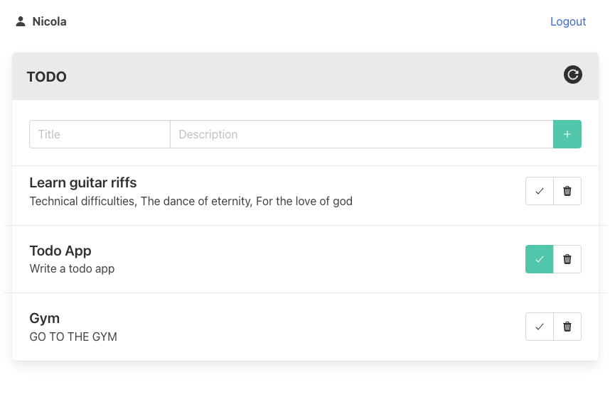

# Todo app

A multi user todo app powered by modern technologies.

### Run the app

#### `python docker/compose.py`

## Technologies

### [Frontend](./frontend/)

-   `Svelte`
-   `Bulma`

### [Backend](./api/)

-   `Postgres`
-   `Fastify`
-   `JWT`

### [Putting it all together](./docker/)

-   `Docker`
-   `docker-compose`
-   `localtunnel`
